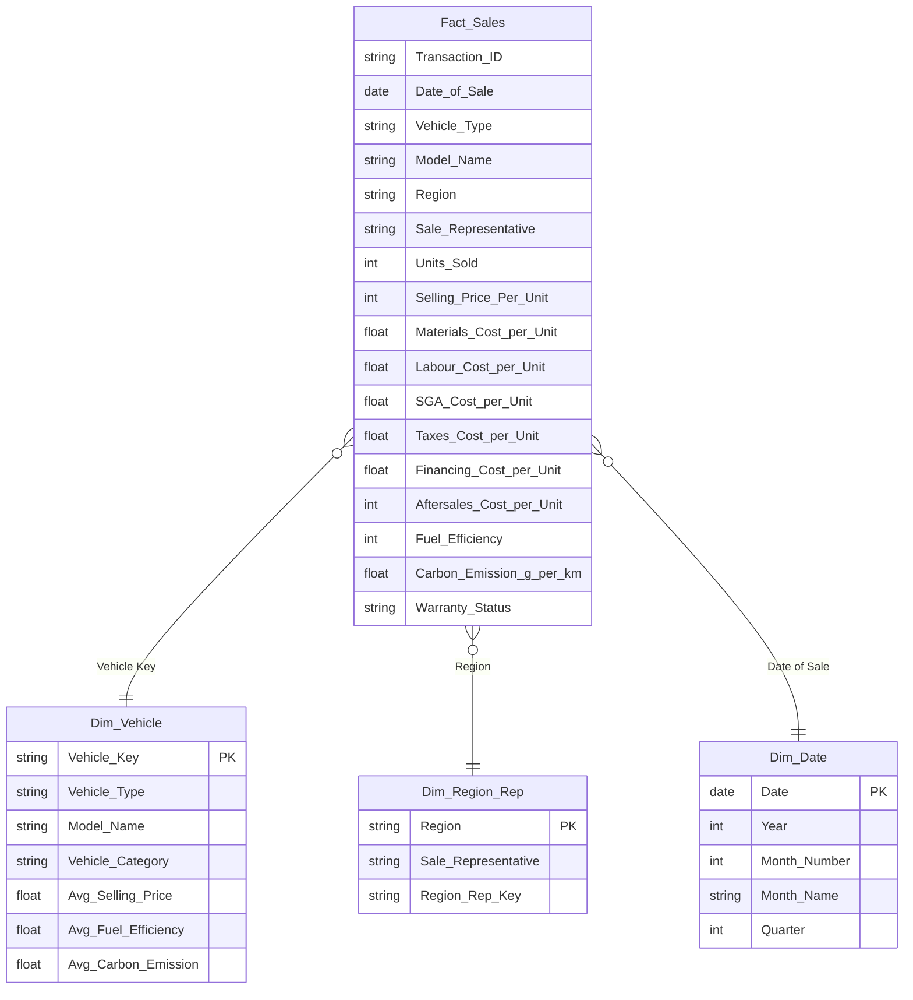

# 🚗 Eco Drive Motors — Power BI Business Intelligence Dashboard

**An 8-page executive Power BI report analysing sales, profitability, and environmental sustainability for a UK automotive retailer transitioning to electric vehicles.**

[](#-live-dashboard)
[](./dax/measures.md)
[](#-data-model)
[]()

### 🔗 Live Dashboard
**[▶ Open the interactive Power BI report](https://app.powerbi.com/view?r=eyJrIjoiNmFjYTQ1MzEtMzk3Mi00N2VkLWE5OGEtYjdkNGIzOTIzZDZkIiwidCI6IjNjZDA3OTg4LTUyNjMtNDA2NC1hZDU1LWU5NTZhYjNkZDExNyIsImMiOjEwfQ%3D%3D)**

---

## 📑 Table of Contents
- [Project Purpose](#-project-purpose)
- [Key Results at a Glance](#-key-results-at-a-glance)
- [Dashboard Structure (8 Pages)](#-dashboard-structure-8-pages)
- [Data Model](#-data-model)
- [Business Insights](#-business-insights)
- [Advanced DAX Highlights](#-advanced-dax-highlights)
- [Tools & Techniques](#-tools--techniques)
- [Repository Structure](#-repository-structure)
- [How to Explore This Project](#-how-to-explore-this-project)
- [References](#-references)

---

## 🎯 Project Purpose

**Eco Drive Motors** is a UK-based automotive retailer operating across five regions — London, Manchester, Birmingham, Leeds, and Edinburgh — selling Diesel, Petrol, and Electric Vehicles (EVs) to private and fleet customers.

The UK transport sector is responsible for roughly **25% of national CO₂ emissions**, and the UK Government has committed to **banning new petrol/diesel vehicle sales by 2030** and reaching **net-zero by 2050**. This puts every automotive retailer's product mix under direct commercial and regulatory pressure.

This dashboard was built to answer one central question for Eco Drive Motors' leadership:

> **"Is the business performing well commercially, and is it on track to meet the 2030 EV transition target — and if not, where should it act first?"**

To answer this, the report analyses **2,000 transactions (Jan–Mar 2023)** across a relational data model and distils performance into a **three-KPI framework**:

| KPI | Focus | Business Question |
|---|---|---|
| **KPI 1 — Sales & Revenue** | Revenue & volume by vehicle type, model, region, rep, time | Which segments are over/under-performing commercially? |
| **KPI 2 — Profit Contribution** | Gross profit, net profit, margins by vehicle type/model | Which products are most/least profitable, and why? |
| **KPI 3 — Sustainability Performance** | Emissions, fuel efficiency, EV adoption, CO₂ avoided | How close is the business to the UK's 2030 EV target? |

The end deliverable is a decision-support tool that converts raw transactional data into **prioritised, evidence-based recommendations** for commercial strategy and the company's net-zero transition.

---

## 📊 Key Results at a Glance

| Metric | Value | Detail |
|---|---:|---|
| 💰 **Total Revenue** | **£482.9M** | Jan – Mar 2023 |
| 📦 **Total Units Sold** | **14,850** | Across 3 vehicle types, 5 models |
| 🔋 **EV Market Share** | **25.3%** | 3,764 EV units sold |
| 🏆 **Net Profit** | **£100.4M** | 20.8% overall margin |
| 📈 **Gross Profit** | **£143.1M** | 29.6% margin |
| 🥇 **Top Region** | **Manchester — £102.6M** | £10.1M ahead of lowest region |
| 🥉 **Lowest Region** | **Birmingham — £92.5M** | Targeted intervention recommended |
| 🛢️ **Most Profitable Type** | **Diesel — 24.3% margin** | £35.3M net profit |
| ⚡ **Least Profitable Type** | **Electric — 16.2% margin** | 8.1pp behind Diesel |
| 🌍 **Avg. EV Emissions** | **66.5 g/km** | 39.5% lower than fossil fuel average |
| 🌱 **Est. CO₂ Avoided** | **~2,453 tonnes/year** | Based on 15,000 km avg. annual mileage |
| 🎯 **Gap to 2030 EV Target** | **74.7 percentage points** | Current 25.3% → Target 100% |

---

## 🗂️ Dashboard Structure (8 Pages)

| # | Page | Description |
|---|---|---|
| 1 | **Title Page** | Project cover — module, business case, dataset period |
| 2 | **Introduction** | Company & industry background, dataset overview, 3-KPI analytical framework |
| 3 | **KPI 1 — Sales & Revenue** | Revenue by vehicle type/region, monthly trend line, sales rep leaderboard |
| 4 | **KPI 2 — Profit** | Revenue vs. cost structure, profit margin by type, profitability matrix by model |
| 5 | **KPI 3 — Sustainability** | Carbon emissions comparison, EV adoption gauge vs. 2030 target, CO₂-avoided scenario |
| 6 | **KPI Rationale** | Academic/strategic justification for each KPI choice, with cited key insights |
| 7 | **Conclusion & Recommendations** | Cross-KPI summary + 4 prioritised, evidence-based recommendations |
| 8 | **References** | Harvard-style bibliography — 17 sources (DfT, BEIS, IEA, Bloomberg NEF, Deloitte, etc.) |

> A hidden 9th page (**Tooltip**) provides on-hover detail for chart data points and isn't part of the navigable report.

📸 *Page screenshots: see [`/docs/images`](./docs/images) — add exported page images here for a fully visual README.*

---

## 📐 Data Model

A clean **star schema** — one fact table surrounded by descriptive dimension tables — built for fast, accurate DAX aggregation:



| Table | Rows | Purpose |
|---|---:|---|
| `Fact_Sales` | 2,000 | Transaction-grain sales fact table (23 columns) — the analytical core |
| `Dim_Vehicle` | 15 | Vehicle Type × Model lookup with average price/efficiency/emission |
| `Dim_Region_Rep` | 5 | Region ↔ Sales Representative mapping |
| `Dim_Date` | 90 | Standard date dimension (day/week/month/quarter) |
| `Waterfall_Data` | 5 | Disconnected helper table (`Revenue → COGS → Gross Profit → Opex → Net Profit`) driving the KPI 2 waterfall chart |

All relationships are single-direction, `Many : 1`, built on **Power Query–cleaned data** (2 null-value rows removed prior to modelling, per data quality best practice).

---

## 💡 Business Insights

### KPI 1 — Sales & Revenue
- Revenue is fairly evenly spread across all 5 regions, but **Manchester (£102.6M) outperforms Birmingham (£92.5M) by £10.1M (~10.9%)** — the widest regional gap in the dataset.
- All 5 sales representatives perform within a tight band, indicating **balanced market penetration** rather than one outlier driver.
- Petrol remains the single largest revenue contributor (£213.9M, 44.3% of total), with Electric close behind growth-wise at £123.4M (25.5%).

### KPI 2 — Profit Contribution
- **Diesel is the most profitable vehicle type (24.3% net margin)**, followed by Petrol (21.1%) and Electric (16.2%) — an **8.1 percentage-point gap** between Diesel and EV margins, driven by higher EV battery, production, and after-sales costs.
- At model level: **Diesel Model C (24.6%)** is the single most profitable product; **Electric Model D (15.9%)** is the least profitable, flagged as a priority for cost-structure review.

### KPI 3 — Sustainability Performance
- EVs average **66.5 g/km** carbon emissions — **39.5% lower** than the fossil-fuel fleet average (109.96 g/km).
- Selling 3,764 EVs instead of fossil-fuel equivalents avoids an estimated **~2,453 tonnes of CO₂ per year** (at 15,000 km average annual mileage).
- At a **25.3% EV share**, Eco Drive Motors sits **74.7 percentage points away** from the UK Government's 100%-EV-by-2030 target — the single largest strategic gap surfaced by the analysis.

### Prioritised Recommendations
1. **Accelerate EV sales toward 40%+ market share by 2025** — leverage government EV subsidies and favourable fleet financing terms; prioritise stock in top-revenue regions.
2. **Reduce EV unit cost to lift margin above 20%** — negotiate long-term battery supply agreements and renegotiate after-sales/warranty cost structures.
3. **Targeted commercial intervention in Birmingham** — localised EV marketing and a quarterly review cadence; closing 50% of the Manchester–Birmingham gap is estimated to add ~£5M in revenue.
4. **Use Diesel profitability as a transitional investment fund** — channel Diesel's £35.3M net profit into EV charging infrastructure, battery R&D, and workforce reskilling rather than an abrupt phase-out.

---

## 🧠 Advanced DAX Highlights

The model contains **89 DAX measures**. Beyond standard aggregations, it makes deliberate use of several advanced patterns — full catalogue in **[`/dax/measures.md`](./dax/measures.md)**.

### 1. Dynamic Top-N ranking, context-aware
Finds the top-performing **region** and **sales rep** live, regardless of which slicers are applied — using `SUMMARIZE` + `RANKX` + `ALLSELECTED`/`ALL` so the ranking recalculates per filter context rather than being hardcoded.

```dax
Main_Top_Sales_Rep =
VAR SummaryTable =
    CALCULATETABLE(
        SUMMARIZE(
            'Fact_Sales',
            'Fact_Sales'[Sale Representative],
            "RevenueValue", SUMX('Fact_Sales', 'Fact_Sales'[Units Sold] * 'Fact_Sales'[Selling Price Per Unit])
        ),
        ALL('Fact_Sales'[Sale Representative]),
        ALL('Fact_Sales'[Region]),
        KEEPFILTERS(VALUES('Dim_Date'[month_slicer])),
        KEEPFILTERS(VALUES('Fact_Sales'[Vehicle Type]))
    )
VAR TopRepTable = TOPN(1, SummaryTable, [RevenueValue], DESC)
RETURN
MAXX(TopRepTable, 'Fact_Sales'[Sale Representative])
```

### 2. What-if scenario modelling
A `SWITCH`-driven scenario measure that recomputes **annual CO₂ output as if the entire EV fleet had instead been sold as Petrol or Diesel** — powering an interactive "Current vs. If-Petrol vs. If-Diesel" comparison chart.

```dax
Scenario_Avg_Emission =
VAR SelectedType = SELECTEDVALUE('Fact_Sales'[Vehicle_Type_Display])
RETURN
    SWITCH( SelectedType,
        "Current (EV)", CALCULATE(AVERAGE('Fact_Sales'[Carbon Emission (g per km)]), 'Fact_Sales'[Vehicle Type] = "Electric"),
        "If Petrol",    CALCULATE(AVERAGE('Fact_Sales'[Carbon Emission (g per km)]), 'Fact_Sales'[Vehicle Type] = "Petrol"),
        "If Diesel",    CALCULATE(AVERAGE('Fact_Sales'[Carbon Emission (g per km)]), 'Fact_Sales'[Vehicle Type] = "Diesel")
    )
```

### 3. Auto-generated narrative insight text
DAX measures that write **plain-English commentary** directly from the live data, so the insight sentence updates automatically as filters change — no manually-typed commentary.

```dax
Dynamic_Gap_Analysis =
VAR ManchesterRev = CALCULATE([Total_Revenue_Numeric], 'Fact_Sales'[Region] = "Manchester")
VAR BirminghamRev = CALCULATE([Total_Revenue_Numeric], 'Fact_Sales'[Region] = "Birmingham")
VAR GapAmt = (ManchesterRev - BirminghamRev) / 1000000
VAR GapPct = DIVIDE((ManchesterRev - BirminghamRev), BirminghamRev)
RETURN
"🟡  Gap Analysis: Manchester outperforms Birmingham by £" &
FORMAT(GapAmt, "#,##0.1") & "M (" & FORMAT(GapPct, "0.0%") & "). " &
"Regional differentiation is relatively low, indicating balanced market penetration."
```

### 4. DAX-generated SVG icons & rank badges
Measures that build **inline SVG markup as a string** (medal-coloured rank circles, performance icons) returned directly from DAX and rendered via image/HTML-content visuals — no static image assets required.

```dax
Circle =
VAR SalesRank = RANKX(ALL(Dim_Region_Rep), [Total_Revenue_Numeric], , DESC, Dense)
VAR CircleColor = SWITCH(SalesRank, 1, "FFD100", 2, "BFC5C9", 3, "C3803F", 4, "F0F0F0", 5, "FCE4E4", "FFFFFF")
VAR TextColor = SWITCH(SalesRank, 5, "A52A2A", "333333")
RETURN
IF(
    ISINSCOPE(Dim_Region_Rep[Sale Representative]) && SalesRank <= 5,
    "data:image/svg+xml;utf8,<svg xmlns='http://www.w3.org/2000/svg' viewBox='0 0 100 100'>" &
    "<circle cx='50' cy='50' r='48' fill='%23" & CircleColor & "' />" &
    "<text x='50' y='58' text-anchor='middle' font-size='48' font-family='Segoe UI' font-weight='bold' fill='%23" & TextColor & "'>" & SalesRank & "</text></svg>",
    BLANK()
)
```

### 5. Disconnected-table waterfall pattern
A small **disconnected `Waterfall_Data` table** (`Revenue → COGS → Gross Profit → Opex → Net Profit`) paired with a `SELECTEDVALUE` + `SWITCH` measure routes the correct financial value to each waterfall step — the standard professional pattern for building a Profit Bridge chart in Power BI without a native waterfall data structure.

```dax
Waterfall_Value =
VAR Selection = SELECTEDVALUE(Waterfall_Data[Category])
RETURN
    SWITCH(
        Selection,
        "Revenue", [Total_Revenue_Numeric],
        "COGS", [Total_COGS],
        "Opex", [Total_Opex],
        "Gross Profit", [Gross_Profit],
        "Net Profit", [Net_Profit]
    )
```

### 6. Live conditional-formatting color logic
Standalone color-hex measures (`Net_Profit_Color`, `Subtitle_Color`, `Revenue_Color`, `Difference_Color_Logic`) bound to font/background color formatting — profit and growth automatically render green, losses/declines automatically render red, without manual rule sets.

### Other notable techniques in the catalogue
- `ISFILTERED` / `ISINSCOPE` / `SELECTEDVALUE` for filter-state-aware dynamic titles and subtitles
- Dense `RANKX` for "highest vs. lowest margin" star/arrow icon logic at model level
- `AVERAGEX` over `FILTER(VALUES(...))` to build a dynamic "fossil fuel average" baseline that excludes EVs automatically

---

## 🛠️ Tools & Techniques

- **Power BI Desktop** — report authoring & data modelling
- **Power Query** — data cleaning/transformation (null-row removal, column shaping)
- **DAX** — 89 measures (KPIs, dynamic ranking, scenario modelling, conditional formatting, SVG generation, narrative text)
- **Star-schema data modelling** — 1 fact table + 4 dimension/helper tables
- **Custom visuals** — HTML Content visual (for fully custom-styled layout cards), advanced slicers, gauge, waterfall, donut, clustered bar, line, matrix/pivot, tooltip page
- **Data storytelling** — KPI framework grounded in academic/regulatory citation (Harvard referencing, 17 sources)

---

## 📁 Repository Structure

```
ecodrive-motors-powerbi-dashboard/
├── README.md                  # You are here
├── LICENSE
├── data/
│   └── EcoDriveMotors_Dashboard.pbix   # Full Power BI report file
├── dax/
│   └── measures.md            # Full catalogue of all 89 DAX measures
└── docs/
    └── images/                # Page-by-page dashboard screenshots
```

---

## 🚀 How to Explore This Project

1. **Fastest** — open the **[live interactive report](https://app.powerbi.com/view?r=eyJrIjoiNmFjYTQ1MzEtMzk3Mi00N2VkLWE5OGEtYjdkNGIzOTIzZDZkIiwidCI6IjNjZDA3OTg4LTUyNjMtNDA2NC1hZDU1LWU5NTZhYjNkZDExNyIsImMiOjEwfQ%3D%3D)** in your browser — no installation needed.
2. **Full access** — download [`data/EcoDriveMotors_Dashboard.pbix`](./data/EcoDriveMotors_Dashboard.pbix) and open it in the free [Power BI Desktop](https://www.microsoft.com/en-us/power-platform/products/power-bi/desktop) to inspect every measure, query, and visual interaction directly.
3. **Just the DAX** — browse [`dax/measures.md`](./dax/measures.md) for the full measure catalogue without opening Power BI at all.

---

## 📚 References

The report is fully Harvard-referenced (17 sources) on the in-dashboard **References** page, including the UK Department for Transport, BEIS Net Zero Strategy, IEA Global EV Outlook, Bloomberg NEF, Deloitte, and SMMT. See the live dashboard's final page for the complete bibliography.

---

<p align="center"><i>Built with Power BI · Star-schema modelling · 89 DAX measures</i></p>
